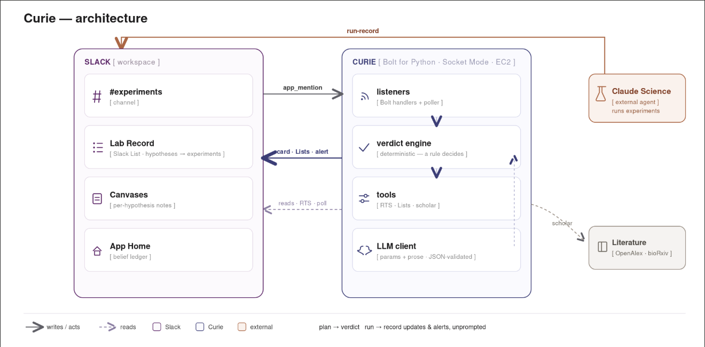

# Curie

**Lab memory in Slack — so no experiment starts blind, and nobody has to keep an ELN.**

You talk to it as **@Prior**. Curie is the product; @Prior is the agent.

---

## The problem

Labs already know what failed and why — it's in Slack. The day someone leaves, that knowledge is gone. Electronic lab notebooks are supposed to catch it; people don't file into a second system, so the dead experiment gets re-run.

## What you do

In `#experiments`, mention a plan:

```
@Prior planning to fine-tune the ESM baseline, lr 1e-4, batch 32, v1
```

Curie checks Slack history, the Lab Record, and the literature, then returns one verdict:

- **Collision** — already tried (who, when, settings, outcome)
- **Near-miss** — close; here's what differs
- **Clear** — nothing found; go ahead

No forms. When a result lands in the channel (from a person or another agent), Curie updates the record. If a hypothesis actually flips, it says so without being asked. Ask `@Prior where does the lab stand?` for the map of what's supported, refuted, or still open.

---

## Architecture



Slack holds the memory (channel, List, canvases, App Home). Curie is a small Bolt app on EC2 — Socket Mode, no public URL. The model extracts parameters and writes the explanation; a rule decides the verdict so the same plan can't get two answers.

More detail: [docs/architecture.md](docs/architecture.md).

---

## Run it

1. Create a Slack app from `manifest.json`, install it, turn on Agents & AI Apps.
2. Copy `.env.sample` → `.env` (bot token, app token, OpenAI key, channel id).
3. Then:

```bash
pip install -r requirements.txt
python -m seed.run    # once
python app.py
```

Optional checks: `python scripts/smoke_tests.py api` · `python -m eval.run` (must show zero false collisions).

Always-on hosting: [deploy/aws-ec2.md](deploy/aws-ec2.md).

---

## Layout

| Path | What |
| --- | --- |
| `listeners/` | Slack handlers + channel poller |
| `pipeline/` | Verdict, logging, hypothesis ledger |
| `tools/` | Search, Lists, literature, cards |
| `llm/` + `prompts/` | One LLM client, validated JSON |
| `seed/` | Demo lab story |
| `eval/` | Calibration — fails on false collisions |
| `docs/` | Specs + architecture diagram |

---

## License

[Apache 2.0](LICENSE) · Slack Agent Builder Challenge, New Slack Agent track
